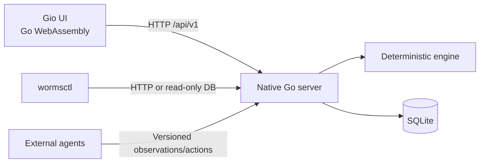

# Worms NG

Worms NG is a deterministic, browser-playable territory game inspired by the
1983 Atari 8-bit game *Worms?*. Worms move between neighboring dots on a
six-direction lattice, leave trails, and capture a territory when they complete
its sixth boundary. The project adds teachable local-pattern brains, autonomous
controllers, external agents, tournaments, replay tooling, and optional modern
rules while keeping the classic rules path deterministic.

The application is written in Go. The browser client is compiled to WebAssembly
and rendered with [Gio](https://gioui.org/); a native Go HTTP server embeds that
client, owns the SQLite database, and exposes the versioned API used by the UI,
CLI, and agents.

## Features

- Deterministic classic game engine, seeded boards, snapshots, hashes, and replay
- Human play and NEW, AUTO, WILD, SAME, scripted, random, external, and structured
  LLM agent controllers
- Teachable local-pattern brains with immutable versions, lineage, provenance,
  and per-rule usage
- SQLite persistence for games, events, snapshots, brains, and tournaments
- Responsive Gio WebAssembly UI with teaching controls and an in-game brain
  inspector
- `wormsctl` commands for brain-by-ID inspection, brain diffs, replay,
  verification, and redacted diagnostic export
- Versioned observation/action protocol and a deterministic reference agent
- Opt-in obstacles, holes, larger seeded worlds, weighted territory, one-way or
  temporary trails, energy, teams, fog of war, rule sharing, and strategic
  teaching experiments

## Architecture



The WebAssembly client never opens SQLite directly. All authoritative mutations
pass through the server, which uses optimistic event cursors and hashes to reject
stale writes.

## Requirements

For the normal browser build and server:

- Go matching [`go.mod`](go.mod) (currently Go 1.25 or newer)
- GNU Make
- A SHA-256 utility (`sha256sum`)
- Chrome, Chromium, or Edge 120+ for the release-tested browser path

`make build-wasm` runs the pinned `gogio` version through `go run`, so a separate
Gio installation is not required. Building the optional native Gio client with
`make build-native` additionally requires `pkg-config` and the platform X11/XKB,
Wayland, and EGL development headers. SQLite is linked through
`modernc.org/sqlite`; the `sqlite3` command is optional.

## Quick start

From a clean checkout:

```sh
go mod download
make build-server
./bin/worms-server -addr 127.0.0.1:8080 -db worms.db
```

Open <http://127.0.0.1:8080> in a supported browser. The server embeds and serves
the generated Gio WebAssembly assets, so no separate frontend server is needed.
The database is created and migrated on startup.

The server defaults to `:8080` and `worms.db`, so this shorter development flow
is equivalent:

```sh
make run-server
```

Stop the server with `Ctrl-C` or `SIGTERM`.

### Build all primary artifacts

```sh
make build
```

This produces:

- `bin/worms-server` — SQLite-backed HTTP server with embedded WASM client
- `bin/wormsctl` — inspection, replay, and diagnostic CLI
- `bin/worms-agent` — deterministic reference external agent
- content-addressed browser assets under `cmd/worms-server/web/`

Generated binaries, WebAssembly assets, databases, and `dist/` release artifacts
are build products and should not be committed.

## Playing

1. Open the browser client and configure the game and participants.
2. Choose a controller for each worm. Human and NEW brains can request a teaching
   decision; AUTO and WILD provide deterministic automated behavior; SAME reuses
   the last completed brain for that slot.
3. Start the game. Choose among the six legal directions shown by the client.
4. A trail cannot be reused. The worm completing the sixth edge around a
   territory captures it. A worm with no legal move dies.
5. Pause and resume from the UI. Reloading resumes the persisted game from the
   authoritative SQLite-backed state.
6. Open the Brains screen to inspect a brain by ID, its decoded patterns,
   decisions, provenance, and usage.

The canonical direction order is East, SouthEast, SouthWest, West, NorthWest,
and NorthEast. See the [player guide](docs/player.md) and
[classic rules](docs/classic-rules.md) for the complete behavior.

## Server configuration

```sh
./bin/worms-server \
  -addr 127.0.0.1:8080 \
  -db /path/to/worms.db \
  -cors-origin https://play.example.test
```

| Flag | Default | Purpose |
| --- | --- | --- |
| `-addr` | `:8080` | HTTP listen address |
| `-db` | `worms.db` | SQLite database path or URI |
| `-cors-origin` | empty | Comma-separated allowed browser origins; `*` allows all |

The binary does not provide authentication, TLS, rate limiting, or secret
management. Bind it to loopback for local use. Before exposing it to a network,
put it behind an authenticated TLS reverse proxy and use a narrow CORS
allow-list. Health and compatibility endpoints are available at:

```sh
curl --fail http://127.0.0.1:8080/api/v1/health
curl --fail http://127.0.0.1:8080/api/v1/build
curl --fail http://127.0.0.1:8080/api/v1/schema
```

See [configuration](docs/configuration.md), the [operator runbook](docs/operator.md),
and [backup, migration, and replay operations](docs/replay-migration-backup.md).

## Brain inspection and replay

`wormsctl` reads through either the HTTP API or a direct read-only SQLite source.
Choose exactly one source with `--api` or `--db`:

```sh
# Inspect a brain by stable brain ID through the running server.
./bin/wormsctl --api http://127.0.0.1:8080 \
  brain show baseline --json --rules --provenance --games

# Inspect an offline database and compare two immutable versions.
./bin/wormsctl --db worms.db brain show baseline --version 2 --json
./bin/wormsctl --db worms.db brain diff version-one-id version-two-id --json

# List, verify, and replay persisted games.
./bin/wormsctl --db worms.db game list --json
./bin/wormsctl --db worms.db game verify game-id --json
./bin/wormsctl --db worms.db game replay game-id --seek 25 --json

# Produce a portable redacted diagnostic document.
./bin/wormsctl --db worms.db --redact \
  diagnostic export baseline game-id --out incident.json
./bin/wormsctl diagnostic import incident.json --out normalized.json
```

Environment variables can provide the source:

```sh
export WORMS_DB=/path/to/worms.db
./bin/wormsctl game list --json

WORMS_API_URL=http://127.0.0.1:8080 \
  ./bin/wormsctl brain show baseline --json
```

Direct database inspection should use a backup or a quiesced database when the
output must remain stable. See [brain debugging and replay](docs/brain-debug.md)
for filters, exit codes, corruption handling, and diagnostic import rules.

## External agents

`bin/worms-agent` is the reference synchronous agent. It reads one versioned
`DecisionRequest` JSON object from standard input, chooses the first legal action
in engine order, and writes one `DecisionResponse` JSON object to standard
output. It intentionally receives only the observation contract and has no
engine or database dependency.

Schemas, endpoint payloads, concurrency behavior, and error envelopes are
covered by the [API reference](docs/api.md). Agent integrations must preserve the
provided decision ID and API/protocol version and must not infer hidden state.

## Development and verification

Useful targets:

```sh
make test                    # focused engine and server tests
make wasm-test               # compile pure-Go tests for js/wasm
make smoke                   # real server, WASM, SQLite, API, and CLI smoke
make browser-smoke           # real Chromium Gio interaction flow
make performance             # engine, match, store, and WASM budgets
make check-import-boundaries # architecture dependency checks
make db-check DB=worms.db    # SQLite integrity and foreign-key checks
make license-audit           # dependency license inventory
make release-acceptance      # packaged desktop and compact browser paths
```

To execute the UI tests under the actual WebAssembly runtime:

```sh
GOOS=js GOARCH=wasm \
  go test -exec="$(go env GOROOT)/lib/wasm/go_js_wasm_exec" ./internal/ui
```

Run the deterministic native package suites with:

```sh
go test ./internal/engine ./internal/protocol ./internal/agent \
  ./internal/store ./internal/server ./internal/match \
  ./internal/tournament ./internal/debug ./internal/extension \
  ./internal/planner ./internal/sharing ./internal/experiment
```

Real browser smoke requires Chromium and `agent-browser`; installation and the
supported viewport matrix are documented in
[browser support](docs/browser-support.md). Release packaging, reproducibility,
checksums, and the complete acceptance sequence are in
[release engineering](docs/release.md).

## Documentation

- [Player guide](docs/player.md)
- [Classic rules](docs/classic-rules.md)
- [API reference](docs/api.md)
- [Configuration](docs/configuration.md)
- [Operator runbook](docs/operator.md)
- [Brain debugging and replay](docs/brain-debug.md)
- [Backup, migration, and restore](docs/replay-migration-backup.md)
- [Browser support](docs/browser-support.md)
- [Performance budgets](docs/performance.md)
- [Release engineering](docs/release.md)
- [Research and replication specification](worms-inspired-agent-game.md)

## Licensing and attribution

Worms NG is an independent implementation and is not affiliated with or endorsed
by Electronic Arts, David S. Maynard, or owners of later *Worms* trademarks.
Original game artwork, sound, logos, and branding are not included. Gio, modernc
SQLite, and other Go modules retain their respective licenses. Review
[licensing, third-party notices, and branding](docs/licensing.md) before
redistributing a build.
